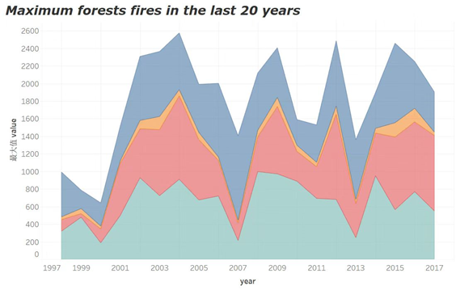
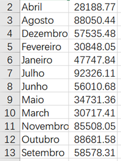

# Week 4

在看了一些资料之后，我发现目前的可视化工具主要分为这几种：

**1.（入门级）网页轻服务类：**

Infogram、pikto、Venngage、Plotly、Canvas等 

 

**2.（进阶级）主流工具类：**

Excel、Tabulea、PowerBi、BDP、DataV、网易有数等

 

**3.（高级）代码类：**

Echarts、D3、Highcharts、google charts、plotly、R/python 等

 

我在初步调研了 Infogram、Venngage、Excel、Tabulea、Echarts、网页有数、R、hanabi等软件之后。选用Venngage、Excel、Tabulea、镝数、R五种不同类型的软件完成了此次的可视化作业。  


## 数据

[数据来源](https://www.kaggle.com/gustavomodelli/forest-fires-in-brazil)

（已经上载仓库）

我选择的是 kaggle 上有关“巴西森林火灾”的数据，原因一是我对这个数据比较感兴趣；二是因为这个数据相对比较简单；三是因为这个数据的可操作性比较强。  


该数据主要记录了 1997 - 2018 年间巴西 26 个州每个月森林火灾的发生次数，几个变量为：  

* `date`、`year` 和 `month`: 标志该条记录的日期  
* `state`: 州  
* `number`: 森林火灾发生次数，每月上报一次    

数据的前 6 行： 


| year | state | month   | number | date       |
| ---- | ----- | ------- | ------ | ---------- |
| 1998 | Acre  | Janeiro | 0      | 1998-01-01 |
| 2000 | Acre  | Janeiro | 0      | 2000-01-01 |
| 2001 | Acre  | Janeiro | 0      | 2001-01-01 |
| 2002 | Acre  | Janeiro | 0      | 2002-01-01 |
| 2003 | Acre  | Janeiro | 10     | 2003-01-01 |
| 2004 | Acre  | Janeiro | 0      | 2004-01-01 |


## 数据可视化及使用体会


1. **Excel**

关于 Excel ,我的使用感想就是比较简单快捷，能够直接生成图表，不用自己去调整或者输入代码，可以做到**数据处理、数据可视化一步到位**。同时它的应用也很广泛，比较适合初学者。

缺点可能是我觉得图表还不够美观和多样，相对比较基础。（当然，这很有可能是因为我没有探索到足够多的功能）

在 Excel 中，我选取的数据是：**五个地区过去二十年每个月发生火灾次数的平均值**


2. **Tableau**  

我觉得 Tabulea 和 Excel 属于一个层级的可视化工具，两者也有比较多的相似之处，Tabulea 的处理很像 Excel 里的数据透视表。它的优点是方便快捷，同时也比 Excel 增加了一些新的功能。**它可以链接市面上几乎所有主流非主流的数据库连接**，也支持本地文件连接；也可以针对多个维度数据进行研究，选择最优表达形式。

Tabulea 对于还不会太多专业图表的初学者来说，应该可以成为首选。

在Tabulea中，我选取的数据是：**五个地区过去二十年火灾发生次数最大值**。  





3. **R**  

在这次写作业过程中，我发现写代码其实是实现可视化的重要一部分，所以我还是尝试了一个第三类型的软件——R。但是写代码实在不是我能自己探索出来的东西，所以我请教了一个朋友, 在他的指导下写出了代码，做出了比较基础的图。对于我来说，学习 R 应该会是一个还很漫长的过程。

R 相对于其他软件来说，实现数据可视化相对来说还是比较复杂的，比方说它需要去分不同的图层慢慢叠加图表、每一个元素都需要用代码去实现。

（这个软件我真的还是处于非常不熟悉的阶段，就不做过多评价、写太多感想了）

在 R 中，我选取的数据是：**所有地区每月的平均值。**



```R
ggplot(month, aes(month, count)) + 
	geom_line(aes(group = 1)) + 
	geom_point(shape = 22, fill = "red", size = 4) + 
	geom_text(aes(label = count), nudge_y = 250) +
	geom_hline(size = 2, color = "black", yintercept = 0) + 
	bbplot::bbc_style() + 
	theme(axis.text.x = element_text(size = 12, face = "italic", angle = 15),
          axis.ticks.x = element_line(size = 0.5),
          axis.ticks.length.x = unit(2, "cm")) + 
	labs(title = "Total Forest Fires Each Month",
         subtitle = "Brazil: 1998 - 2017") 
```


4. **Python**  

因为本学期也有上另一门 Python 爬虫的课程，所有我对 Python 可视化的操作有一些了解。与 R 类似，Python 中也有很多用于数据可视化的包和模组，本次作业中，我选用的是 Seaborn 库，它相对于常见的 matplotlib 更加简单，对图片风格、背景设置等方面做了一些封装。

使用体验是，Python 中的可视化操作比较繁琐，需要记忆很多图表参数，且对数据格式的要求比 Excel 、 Tableau 更高。但好处是图表的定制性得以加强，可选的种类也更多，读取数据也比较方便。

为了图表呈现效果更好，我在 Python 中做了进一步的数据处理，新增了一列 `region`（北部、东北部、中西部、东南部和南部），表示巴西各地区的地理区域归属，分类依据来自 https://en.wikipedia.org/wiki/Regions_of_Brazil，之后呈现**各个区域发生火灾次数的分布**


```python
import numpy as np
import pandas as pd
import seaborn as sns
import matplotlib.pyplot as plt

data = sns.load_dataset("fires")
sns.set_context("notebook")
ax = sns.violinplot(x="number", y="region", data=data,
                   palette="Set3", scale = "width")
sns.despine(offset=10, trim=False)
ax.set_title("Brazilian Forest Fires (1998 - 2017): Regional Distribution")
plt.xlim(0, 200)
```


5. **Venngage**

其实类似这样的网页型软件有很多，我在尝试的时候因为觉得它的模板我自己比较喜欢，所以选择了它。

Venngage 其实给我的感觉和 PS / AI 有点像，相对之前的几个软件更偏设计一些，它的操作也比较傻瓜式，基本刚上手就能懂大部分操作，给的模板和配件也比较多且丰富。

（**所以这里我也有一个疑问**：因为在我们的认知里， PS / AI是不算可视化软件的，但是 Venngage 等是，但是两者的功能其实也差不多，所以我想知道可视化软件的边界在哪里？）

缺点是我觉得它不太适合进行大批量数据的可视化，另外没有数据导入和处理功能，在这一点上不太方便。

在Venngage中，我选择的数据是：**三个地区每月的平均值**


6. **镝数**

镝数其实也可以代表一个小种类：可视化公司自己开发的软件。现在市面上一些比较大的可视化公司都开发了自己的软件，比如：数可视的 hanabi、镝次元数据的镝数、网易数读的网易有数……因为 hanabi 好像是主要用来进行财务分析，镝数相对比较方便，我就选取了镝数作为这次的可视化工具之一。

镝数给我的感觉就是: 比较简单方便，作为一款网页轻服务类可视化，在尝试之后，我觉得它的可操作性超过了 venngage（可能因为 venngage 是偏设计类的工具，但是镝数本身就是在处理数据的，所以很多功能是为数据图表量身定制的）。

目前我还处于初期的探索阶段，我觉得它能够完成比较基础的可视化需求，并且也比较容易上手。

如果要说缺点的话，我觉得可能是它给的模板相对比较固定，能够给自己发挥的空间相对比较小一些。

我选择的数据是**所有地区近五年的火灾发生次数平均值**


因为点击的交互性需要在网页上看，所以老师可以点进链接看图片。


https://www.dydata.io/show/c_f782fe75b352a8963dfcef04c2d8ea93


https://www.dydata.io/show/c_540d1353b96a442f093cc3f087eeaa3d
