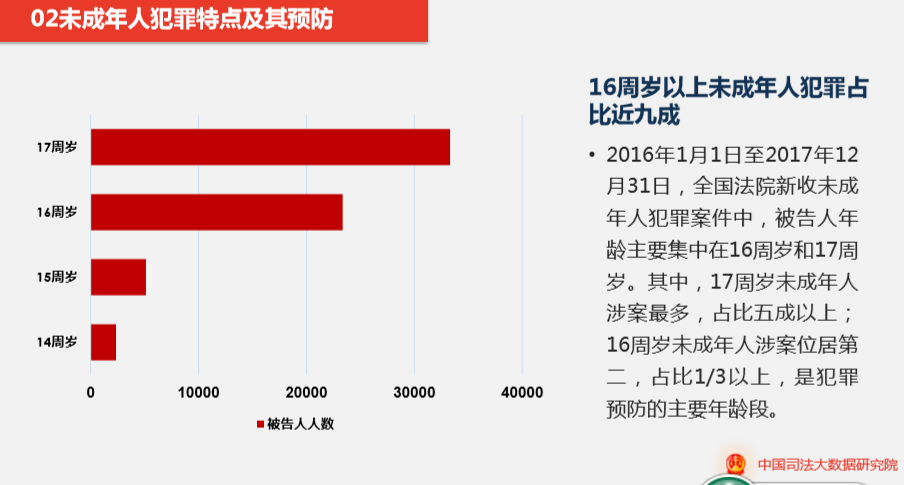
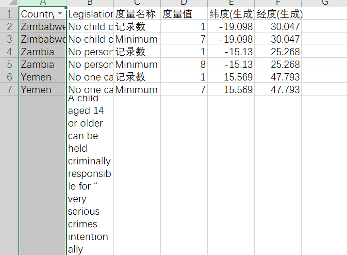
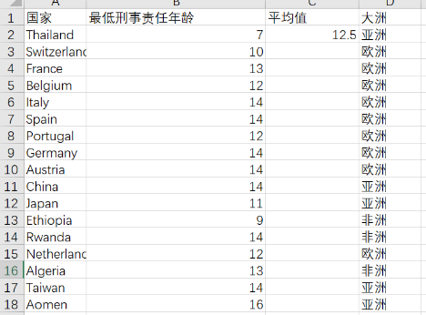
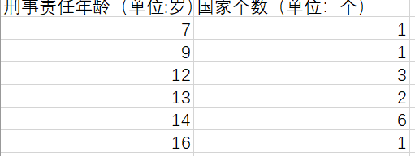
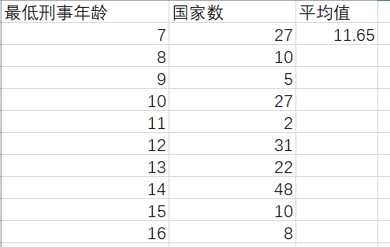
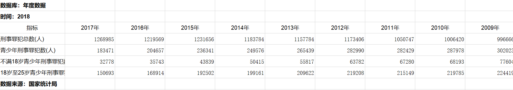
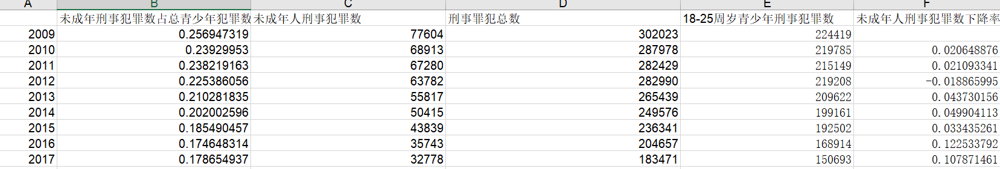

## 一点关于文章的补充解释

1. 关于 **“低龄化”**

本文的低龄化是基于“降低刑事责任年龄”讨论的基础上提出的，所以这里指的是在0-18岁范围内的低龄化，比如从16岁降到了14岁。就与也就是说，第七段中提到的“未成年人犯罪数占青少年总犯罪数比例”与低龄 / 高龄无关，只能证明犯罪率的下降。

低龄化的直接证明还是需要各个年龄段的具体数据，但是近几年并没有特别详细的数据，因此我只能用笼统的数据进行论证，应该有更多数据去完整论证的。

而且，我觉得关于各年龄段的数据统计存在一个很大的逻辑问题：犯罪的未成年人才会被纳入统计内算占比，但是根据刑法规定：14-16周岁就不需要负完全刑事责任，14周岁以下不需要负任何刑事责任。换句话说，这部分人只会成为分母，而不会成为分子，统计出来自然是16周岁以上占比最大。我猜，是不是因此才会有司法大数据研究院统计出来的：“九成犯罪的未成年人都在16周岁以上”这样比较令人难以信服的数据，这和我看到的很多数据是有冲突的，也和事实不符。

 

2. 美国各洲刑事责任年龄划定

美国是一个比较特殊的国家，在全美50个州中，有27个州规定了追究刑事责任的最低年龄。加利福尼亚等大多数州和日本一样是14岁，科罗拉多等州是12岁，堪萨斯等两个州是10岁。在没有规定最低年龄的州，法官可以根据犯罪的严重和恶劣程度，决定在少年法庭还是移交一般刑事法庭进行审判。鉴于其复杂性，这次统计的190个国家并没有美国。

 

3. 为什么英美法系“因此刑事责任年龄标准可以根据实际情况上下浮动，刑事责任年龄也相对较低。

这个逻辑可能一下子有些难以理解，所以我想要再解释一下。说得通俗一些，英美法系给了法官更多判决的空间，犯罪者也有了更多“被考虑”、“被重新裁定”的机会，因此最低刑责年龄可以划得更低。而大陆法系是一个“一刀切”的划定，相对更加严格。举个例子，哪怕刑事责任年龄划到0岁，都要严格按照法律执行，1岁就要开始负相应的刑事责任，所以必须把刑责年龄划高，才能减小伤害。

 

数据来源 (data / week 6 / 路径下)：

1、 国家统计局：http://www.stats.gov.cn/

使用数据见Excel: 年度数据

 

2. Child Rights International Network:

https://home.crin.org/issues/deprivation-of-liberty/minimum-age-of-criminal-responsibility

使用数据见Excel：世界各国最低刑事责任年龄

 

3.中国青少年研究中心：http://www.cycs.org/

使用数据：见原文

 

## 参考文献 

1. 曾少璐，《调整我国刑事责任年龄之分析》，上海师范大学，法制博览，2019-09

2. 肖建国，《“低龄作案者”刑事责任年龄的探究》，上海法学研究，2019-09

3. 曾粤兴、高正旭，《“恶意补足年龄”规则引入论之反思》，河北工业大学学报，2019-09

4. 甘艳君，《青少年犯罪的定罪与量刑几个问题讨论》，法制博览，2018-10

5. 张戈曦，《青少年犯罪现状及预防探讨》，犯罪研究，2019-06

6. 《司法大数据专题报告之未成年人犯罪》，司法大数据研究院，2018-06

7. 赵迪、王博，《英美法系与大陆法系联系与区别》，企业导报，2015-08

8. 吴瑞益，《“估堆量刑”与“必减主义”之省思——未成年人犯罪规范化量刑模式构建》，预防青少年犯罪研究，2015-10

 

## 数据收集过程

相比于上次“找不到数据”，我觉得这次的问题在于“不知道该找什么数据”。“未成年犯罪”如果要定量去研究，其实更适合选取一个地区或者国家统计：犯罪率、犯罪年龄、犯罪原因、犯罪种类等，而我这次选择的角度“刑事责任年龄”更适合定性研究，所以在选取数据上有很大的难度，并且用数据去论证自己的观点也相对比较复杂。

 

刚开始在论证“是否应该降低刑事责任”的时候，我想要选取的几个数据集是：未成年人各个年龄段的犯罪率、各个国家的刑事责任年龄、近几年犯罪率的对比。但是我在搜集未成年人各个年龄段犯罪率的时候，我发现相关的数据集非常少，其次是可能因为标准不一样，每个不同来源的数据显示的比例都不太一样，，所以我不知道该如何选择，害怕有失客观性。

 

因此在这次的数据搜集中我的感想是：一些官方数据库能提供的数据过于大略，很难支持深入分析。如国家数据网站上，只把青少年刑事罪犯数划分为两个指标（不满18岁，18岁至25岁），比较关键的14岁以下违法人数和14~16岁青少年犯罪人数都没有提供，也没有他们的犯罪类型分布、案件特征、人口统计等信息，为立论制造了很多困难，只能在发布时间较早的相关论文和组织报告中寻找数据。

再如最高人民法院的大数据专题，虽然形式尚可，但不提供原数据，只有制作出来的图表，很容易让人质疑真实性更重要的是制约了数据的价值 

 

## 数据处理与分析

**1.**   **各国刑事责任年龄**

源数据：

 

1)筛选出大陆法系国家，并处理计算

2）分类汇总大陆法系国家各刑责年龄个数

3）筛选去除最低刑责为0岁的国家，并进行分类汇总

2. 犯罪率

源数据：

 

计算占比及下降率：

 

 

## 选择报道角度的思考过程：

1、 在看到”未成年人犯罪“的时候，我第一反应是大一的时候打的一个辩题”应不应该降低刑事责任年龄“，这个辩题给我提供了很多这次选题的角度：未成年人的再犯率、未成年人犯罪后的收容教养（如少年法庭、少管所等等）、被判刑的未成年人和被收容教育未成年人发展情况的对比……但是这些我都没有找到足够的数据，所以放弃了。看来想写自己喜欢选题的前提是提高查找数据的能力。 

2、 这次的选题角度对我有很大难度，我也请教了师哥师姐，在写的过程中也在不停地质疑自己，或许在刚刚入门的时候，还是应该脚踏实地，选择一个自己能够掌控的角度：刑事责任年龄是不是一个可以去定量研究的东西？又应该怎么去定量研究？我的数据到底能不能论证到这么根本的法律层面问题？我的逻辑链是不是还不够完整？我该怎么把我的数据串起来?希望以后我的能力可以提升到掌控这个选题。

3、 在这次写的过程中，我最大的疑问是：如果有数据支撑，我该不该在一篇新闻中输出自己的观点，尤其是“应该降低刑事责任年龄“这样争议性很强的观点。因为”降低“的论据主要是：心理年龄成熟、犯罪低龄化、参照其他国家法律；极端案例频发，而这些都有数据可以证明不成立。（但是，当我逐渐往这个观点的方向往下写的时候，我觉得整个文章的风格变得很激烈，同时在查找数据的过程中，我也发现不同的数据源可以分析出不同的结果。强烈输出自己的观点似乎失去了应该有的客观性，但当我遵循客观性，努力不输出观点的时候，又会觉得这篇数据新闻没有传递出很有效的信息，整个写作过程会”缩手缩脚“，不够深刻。

4、 这个题还有很多可探讨的空间，出于时间限制，我没有写完。我很想有机会能把它写成论文或者是大作业，完整地探讨一下“未成年人刑事责任“这个问题，下面是几个我没有体现在文章里的事实和想法：

1） 我国目前少年法庭和少管所管理和数量都非常不到位，很多“配套措施“都处于不成熟当中，贸然降低刑责年龄并不可取。——可以研究一下我国少管所/少年法庭目前的数量、分布、管理情况及和其他国家的对比

2） 根据美国1995年的一项调查研究显示，将青少年送进监狱，再犯率达到了80%，而重新教育的再犯率只有20%。把心智还未成熟的未成年人送进监狱，是对他们的一种巨大伤害，未成年人之所以受到保护，就是因为他们还有可矫正和可重新教育的机会，送进监狱并不是最好选择。——青少年再犯率、送进监狱及收容教养的再犯率对比

3） 法律从来都不是实现所有人的公平，而是实现最大多数人的公平；法律也不是一个最好的结果，而是一个“最不坏“的结果。所以如果因为一些极端个案而去动摇法律，是非常不可取的。

4） 极端个案这几年是真的变多了吗？还是只是因为自媒体的发达和夸张报道风格的出现？这些极端又真的是因为低龄化引起的吗？或许这些都还值得更深入的研究。——关于恶性事件的数据对比
