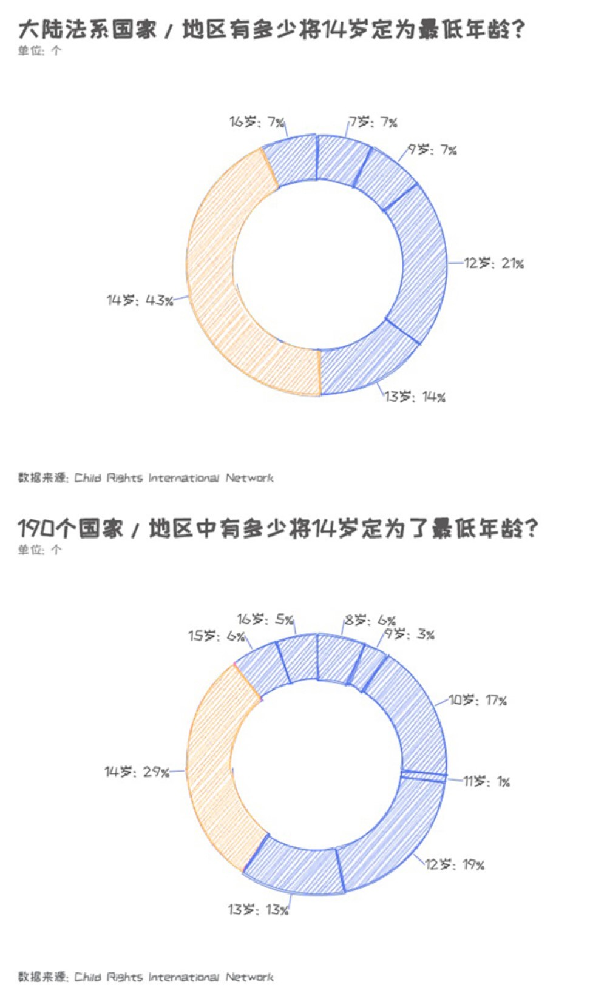
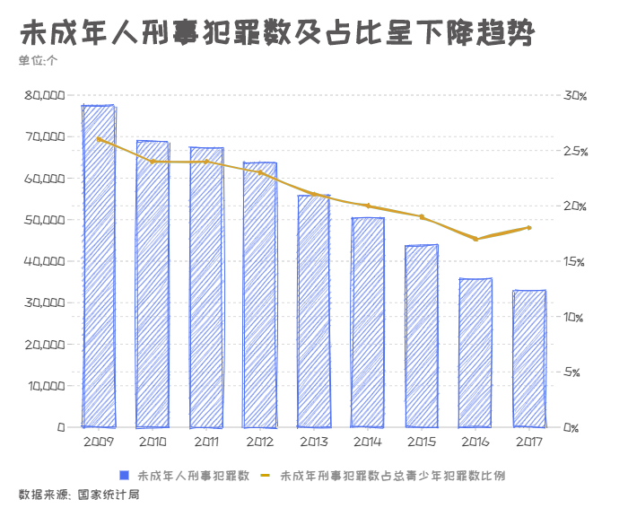

# 14岁少年残忍杀害女童后仅被收容教养三年

​																												降低刑事责任年龄是否应被提议？

近期，“大连十岁女童被害事件”及电影《少年的你》上映将“未成年人犯罪“这一话题再一次推上了风口浪尖。在犯罪事件背后，一种显著意见是：法律正帮助未成年人逃避他们本应承担的刑事责任。《少年的你》中校园暴力的始作俑者被无罪释放、男主角因自己未成年可以少判刑而选择帮女主顶罪；大连14岁少年连捅数刀将十岁女童残忍杀害后，因未达到最低刑事责任年龄只受到了三年收容教养的惩罚。

 

随着1979年《刑法》的生效，刑事责任年龄的划定已延续了四十年，它将年龄分为三个阶段：**完全负刑事责任年龄阶段**（16周岁以上），**相对负刑事责任年龄阶段**（14-16周岁）、**不负刑事责任年龄阶段**（14周岁以下）。简单来说，14-16周岁的未成年人只有在实施故意杀人等八种严重犯罪的，才需要负相应的刑事责任；14周岁以下，无论犯什么罪都不需要负刑事责任。同时也明确，基于《未成年人保护法》，已满14周岁未满18 周岁的人犯罪，应当从轻或者减轻处罚。

 

进入本世纪以来，各地未成年人实施严重违法犯罪行为案件频发，引起媒体的关注和社会的震惊，同时也引发了对刑事责任年龄的争议，对有些实施恶性作案的“低龄作案者”，不少人强烈呼吁修改现行刑法中有关未成年人刑事责任年龄的规定。今年的全国两会上，30名人大代表提交了关于修订《中华人民共和国未成年人保护法》的议案，**议案中建议将最低刑事责任年龄下调到12岁**。

 

对于刑事责任年龄，世界各国有着不同的划分，不同法系也有着不同的制定标准。目前世界上主流的两大法系是大陆法系和英美法系，其中中国的特色社会主义法系主要借鉴了大陆法系。大陆法系又称成文法，在实行大陆法系的国家，只有规范性法律文件才具有法律约束力，法官的自由裁量权受到极大限制；而在英美法系则是判例法，以“遵从先例“原则为基础，结合当下情势进行判决，相对拥有更多自由性，因此刑事责任年龄标准可以根据实际情况上下浮动，刑事责任年龄也相对较低。

 

在亚欧非三大洲的17个大陆法系国家和地区中，最低刑责年龄范围是7-16周岁（最低值为泰国，最高值为澳门）；其中4个国家将标准定在了12周岁以下；6个国家和地区将最低刑事责任年龄顶定为了14周岁，分别为：意大利、西班牙、德国、奥地利、卢旺达和台湾；平均值为12.5岁。在明确规定了刑事责任年龄的190个国家及地区中（包括英美法系和大陆法系），12周岁以下占比为27%；14周岁占比最高，达到了25.2%；平均值为11.6岁。

 

总的来说，在7-16岁的最低刑责年龄区间中，各国存在较大差异。我国刑事责任年龄的门槛与世界平均水平相比偏高。不过，修法的动议归根结底还是要回到催生它的土壤，回到中国的实际国情上。世界各国的经济发展水平、社会结构、人口组成、法律传统千差万别，仅通过与平均值的比较便得出我国应降低刑事年龄的结论，恐怕失于片面。想要探讨刑事责任年龄是否需要调整，更重要的是了解我国国内的具体情况，尤其是未成年人犯罪现状。

 

根据国家统计局的数据，我国未成年人犯罪人数自2009年起逐年下降，下降率在2016年达到了12.3%，2017年达到了10.8%，降幅越来越大。除此之外，自2009年起未成年人刑事犯罪数占25周岁以下青少年刑事犯罪数比例逐年递减，到2016年占比为17.5%，2017年占比仅为17.9%。**尽管这些数据还有些粗略，但至少可以说明我国未成年人犯罪的状况并不像媒体描述的那样可怖，反而得到了一定遏制**。事实上，我国已成为世界上未成年人犯罪率最低的国家之一

 

**然而，未成年人犯罪率不断下降并不意味着犯罪状况完全趋好**：犯罪率在减少的同时，低龄化现象也日益明显。随着时代的发展，现阶段未成年人的心理和生理成长发生了较大的变化，青少年生理、心理早熟的现象已经较为普遍，受网络、媒体和生活环境中的刺激和诱导也更加明显。中国青少年研究中心的调查显示，2001年14周岁的未成年人犯罪人数占比为12.3%，而到了2014年14周岁犯罪人数占比上升到了20.11%。

 

综上，对于“降低刑事责任年龄”的讨论从未陷入了僵局。从一个角度看，进入21世纪后，世界各国接连将“降低刑事责任年龄”纳入考量，中国刑事责任年龄门槛划定在世界相对偏高；犯罪低龄化趋势日益明显、极端个案屡屡出现；有学者提出引入英美法系中的“恶意补足年龄规则”等方案支撑“降低说”。（恶意补足年龄规则：处于一定年龄段的未成年人被推定为不具有刑事责任能力，但若控方提出相关证据证明，这个未成年人在行为实施时具有恶意，能够辨别是非、善恶，则对其不具有刑事责任能力的推定可以被推翻，这名未成年人应当对其实施的行为承担刑事责任。）

 

然而我们也要考虑到，英美法系和大陆法系有本质上的区别，若将英美法系的产物直接照搬到我国，是否会“水土不服；其次，未成年人犯罪情况总体趋好，因为个案而选择降低大标准，违背了《未成年人保护法》中，坚持”教育为主、惩罚为辅“的原则，长期的监禁生活容易摧残心智未发展成熟的未成年人身心，加大其再社会化的难度。[[1\]](#_ftn1)

 

随着时代的发展与社会情况的改变，每条法律的适用性都会不断受到挑战。**然而，在刑事责任年龄这样一个利弊纠缠的重大话题上，我们对它的考虑更应该慎之又慎**。各国的刑事责任年龄标准制定都立足于国情，经历了长时间的讨论与修订，中国也不例外。在这个问题上，还有很大的思考与考虑的空间，法律也会在不断的思考、考虑与修订中趋于完善，实现“最大多数人”的公平。

 

------

[[1\]](#_ftnref1) 曾少璐，《调整我国刑事责任年龄之分析》，上海师范大学，《法制博览》，2019-09