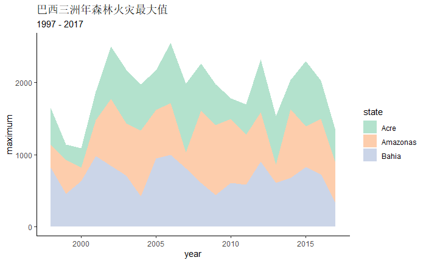
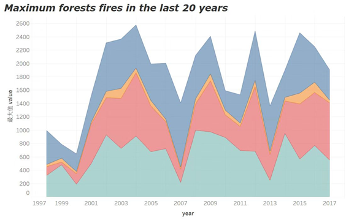
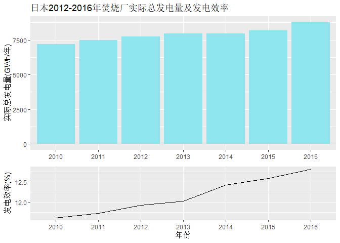
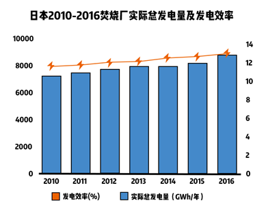
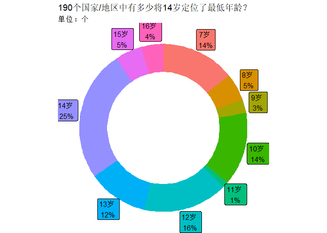
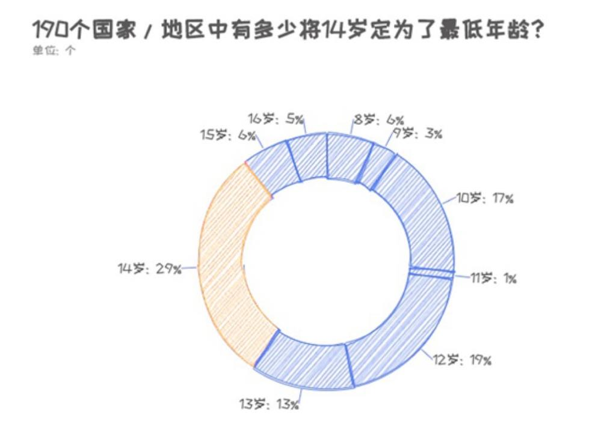

Week 7  

## Week3重做：面积图 

```r
ggplot(mapping=aes(year,maximum))+ 
  geom_area(aes(fill=state))+ 
  scale_fill_brewer(palette="Pastel2")+
  theme_classic()+ 
  labs(title="巴西三洲年森林火灾最大值",subtitle="1997 - 2017")
```


原图：   
 

这次重新作图做了一定简化，没有按照五个地理区域汇总统计火灾最大值，而是随机选取了三个洲，之后画出面积图。比较大的收获是掌握了 R Graphics Cookbook 中使用 `scale_fill_brewer()` 调色板函数的方法。  

目前仍存在的问题有：

* 如何取消面积图底部与坐标轴的间隙  
* 调整 x 轴的显示方法，使每个年份都能被显示  
* 为 y 轴加上单位

## Week5重做：柱形图和折线图

``` r
p1 <- ggplot(data=efficiency)+ 
  geom_col(mapping=aes(x=year,y=total),fill="cadetblue2")+ 
  labs(title="日本2012-2016年焚烧厂实际总发电量及发电效率",x=NULL,y="实际总发电量(GWh/年)")+ 

p2 <- ggplot(data=efficiency,mapping=aes(x=year,y=efficiency))+
  geom_line(aes(group=1))+
  labs(x="年份",y="发电效率(%)")+

p1+p2+plot_layout(ncol=1,heights=c(2.5,1))
```



原图：



遇到的问题有：

* 确定柱形对应的几何对象，`geom_bar()`好像只能提供一个x轴，最后确定应该用`geom_col()`
* 改变柱形的样式，填充色的参数`fill`
* 在折线图上添加数据标记，叠加一次`geom_point()`函数生成的图像

另外，因为 ggplot2 好像不支持双坐标轴，我就想用另一种方式将柱形图和折线图结合在一起。最后搜索到了 patchwork 这个包，可以用一种很简单的方法组合 ggplot2 生成的图形，但不能直接输出图形，而是要将 ggplot2 的输出存储在某个变量里，再用加好连接不同的图形变量，最后用`plot_layout()` 调整相对大小。


## Week6重做：圆环图

``` r
ggplot(data=minimum_age,mapping=aes(ymax=ymax,ymin=ymin,xmax=4,xmin=3,fill=age))+
  geom_rect() +
  geom_label(x=4.5,aes(y=labelPosition,label=label),size=4)+
  coord_polar(theta="y")+
  xlim(c(1, 4)+
  theme_void()+
  theme(legend.position = "none")
```



原图(取整后再数值上有很小的差异)：



在 ggplot2 中做这种圆环图比较麻烦，因为没有直接对应的几何对象，必须做一次坐标系转换。最后在 [R Graphics Gallery](https://www.r-graph-gallery.com/128-ring-or-donut-plot.html) 网掌上找到了一般圆环图对应的代码，模仿出了这张图。
