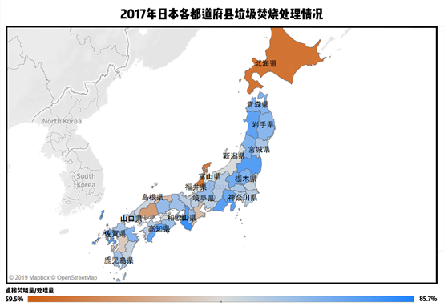

# 垃圾焚烧大国日本名副其实吗？

随着7月1日《上海市生活垃圾管理条例》的实施，我国开始进入“垃圾分类”时代，“垃圾分类”成为全民热议的话题。然而，作为垃圾分类链末端的“垃圾处理”却鲜有提及。

垃圾处理有多种方式，国内外广泛采用的城市生活垃圾处理方式主要有卫生填埋、高温堆肥和焚烧等。由于城市化与工业化的不断发展，能源、土地资源日益紧张，焚烧处理所占比例逐渐增多，成为多数国家的主流垃圾处理方式。根据今年年初出台的“十三五”规划，到 2020 年我国城镇生活垃圾焚烧处理能力要占总无害化处理能力的 50%以上。

 在垃圾焚烧方面日本颇有经验，起步也相当早：1924 年，东京建成了世界首座垃圾焚烧厂；60年代以后政府开始补贴焚烧厂的建设——补贴覆盖建设成本的三分之一到二分之一；2008年起相关规定要求焚烧产生的灰渣必须经过高温熔融处理，垃圾填埋场所的紧张状况得到进一步缓解。

 

最高峰时期，日本的焚烧厂数量一度占到全球的百分之七十。虽然政府因为焚烧所带来的严重污染（如超标的二噁英排放），关停了大量不达标的焚烧厂，但垃圾焚烧处理在日本仍然占主导地位。根据日本环境省数据显示，2017年日本垃圾焚烧处理量占到总无害化处理量的77%，各都道府县的焚烧处理占比多集中在 70% 到 80%。

	

https://public.tableau.com/profile/wangxixi#!/vizhome/Book1_15720839549490/Sheet1?publish=yes

数据来源：日本环境省

焚烧不仅是垃圾处理的手段，也是能量循环的驱动器。基于当下对垃圾进行“减量化、无害化、资源化”的倡导背景，垃圾焚烧发电已经成为大势所趋。尽管日本经常被称为焚烧领域的行家，通过焚烧解决了大部分垃圾处理问题，但其焚烧厂运作状态并非一直理想。比起美国或欧盟各国，日本大部分焚烧炉规模较小，因此其中能够发电的厂并不多。根据日本环境省和 statista 的数据计算，2010年-2014年日本能够发电的焚烧厂平均占比仅为 27%。

 

与此同时，少数能够发电的焚烧厂的发电转化率尚难令人满意。日本政府将发电能效高于23%定义为“高效”，并一直试图提高全国总体发电率。2012-2016 年日本焚烧发电厂的平均发电效率为 12.15%，日本目前最大的垃圾焚烧发电厂——名古屋市新南阳垃圾处理厂的发电率也仅为 16%。[[1\]](#_ftn1)

 

  

数据来源：日本环境省

 

纵观以上数据，虽然日本垃圾焚烧总量及相关技术已经全球领先，解决了“地少人多”、“拥有良好垃圾分类体制”的国家垃圾处理的难题。但焚烧后的能源利用效率面临一定瓶颈，新技术亟待发展，在这方面还需要走很长的路。

------

[[1\]](#_ftnref1)
$$
发电效率=\frac{3600(KJ⁄KWh)×总发电量(KWh⁄年)}{100(kg⁄h)×垃圾焚烧量(t⁄年)×发电量(KJ⁄kg)}
$$
