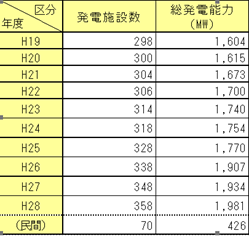
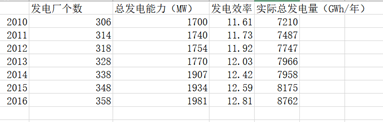
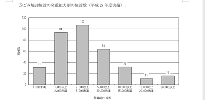
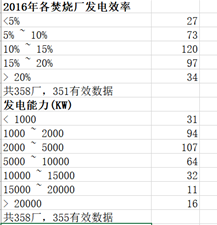
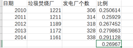
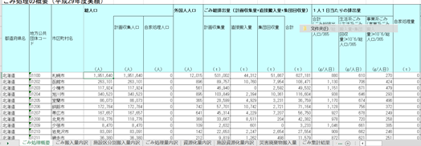
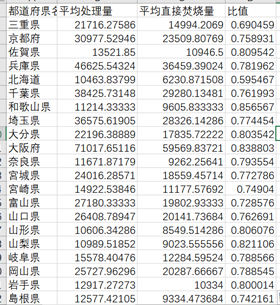
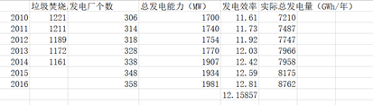
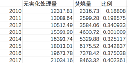

# 过程步骤

## 数据来源 

环境省 http://www.env.go.jp/recycle/waste_tech/

使用数据见Excel: 日本垃圾处理情况汇总.xls

​        					 2016年日本垃圾焚烧发电厂详细数据.xls

  		    			   2010-2016年日本焚烧厂发电效率.xls

 

名古屋 http://www.city.nagoya.jp/kurashi/category/19-14-2-4-0-0-0-0-0-0.html

使用数据见Excel: 南阳工厂.xls

 

经济产业省 https://www.meti.go.jp/

使用数据见Excel: 2016年日本垃圾焚烧发电厂详细数据.xls

 

Statista https://www.statista.com/

使用数据见Excel: 2010-2014年垃圾焚烧厂个数及发电厂所占比例.xls

 

(还有部分原数据显示在计算步骤中)

 

 

 

## 参考文献

1.  水木晴美，《日本垃圾分类及其对海南生态文明建设的启示》，延边大学学报(社会科学版)

2. 诸大建，《有关日本垃圾处理模式的冷思考》，可持续发展经济导刊,2019-08

3.  杨跃，《日本垃圾焚烧发电厂多功能展示——以丰中伊丹资源回收利用中心为例》[J].城乡建设,2018(11):72-75.

4.  服布雄一郎，《日本垃圾分类全报告》，2013

5. 中国网新闻中心《全球视野看垃圾焚烧 日本焚烧厂数量全球第一》，2014-08

6. 中国报告网，《2018年日本垃圾焚烧行业发展历程：世界上最早应用垃圾焚烧发电》， 2018-07

7. 《上海垃圾分类后干垃圾减量明显垃圾焚烧企业该发愁吗》，资源节约与环保，2019-09

 

## 数据收集过程

1. 刚开始的时候，我选择的角度是**“垃圾分类”**。我能想到的量化“垃圾分类”效果的指标是垃圾分类前后各项数据的对比，例如干湿垃圾量、分类垃圾桶投放量、智能设备（感应器、监控器）等投放量、垃圾清运量的前后对比。但是我在收集数据的过程当中发现，由于垃圾分类在四个月前刚刚实施，所以统计结果都很不完整，上海市的各个官方与非官方网站都无数据可查。

2. 后来，我将目标转向了统计结果比较多的**“垃圾处理”**，当时也是出于偷懒的心理，就在中国住建部、国家统计局找了中国的一些官方数据。数据收集并没有什么难度，但是在数据处理的过程中，我发现很多数据与我设想的相差非常大，无法论证我想要得出的结论，于是又转换了角度。

3. 最后，我选择了**“日本的垃圾焚烧”**。垃圾处理概况、焚烧量、发电效率等数据主要来自日本环境省网站，前两者均存储在各年份相邻且格式统一的 Excel 表格中，故获取和整理比较方便。发电效率的查询过程遇到了较大困难，数据被存放在零散的 Word 文档中，且没有统一的目录结构，通览全篇才能抓取到自己想要的部分，且要自己完成格式的统一和汇总工作。之前的阅读作业《电子表格中的数据整理》中也提到，应保证数据存储在易于访问、格式一致的格式中，这次作业让我有了对此更深的体会。

   为了使数据较为全面，我还收集了日本最大的垃圾焚烧厂——名古屋南阳垃圾处理厂的数据，可能因为涉及到商业方面，最终也没有找到该厂的官方发布信源，只能以谷歌提供的名古屋市政信息为准。

## 数据处理与分析

（详细数据直接见表格）

 

1. 初步处理与分析

找到自己想要的和有效的数据。

并统一格式

1)

2）

 

2. 进一步处理

在有效的数据中，计算出最能论证观点的结果。

 

发电厂个数/垃圾焚烧厂个数=比例

再算比例的平均值

 

 

分类汇总后得到日本各地区的平均处理量和平均焚烧量

平均焚烧量/平均处理量=比值

 

$$
发电效率=\frac{3600(KJ⁄KWh)×总发电量(KWh⁄年)}{100(kg⁄h)×垃圾焚烧量(t⁄年)×发电量(KJ⁄kg)}
$$

再算发电效率的平均值
					

 

# 选择报道角度的思考过程

## 总结：

**1、** **不要一味抓热点**

可能因为自己是学新闻的，所以一直写什么都想要抓一个热点，好有足够的新闻由头。比如这次我在看到“垃圾”这个主题之后，就坚定地想要写垃圾分类，后来因为没有足够的数据换了现在的选题。 

我在写现在这个题的过程中发现，其实即使主题不是热点，也可以联系现实，拥有贴近性。结合目前的一些数据新闻来看，抓住受众不一定要靠追求热点来实现。

**2、** **数据要和资料与事实相结合来佐证观点，不能自行预设**

我第二次选择的角度是中国的垃圾处理，我自己预设了一个前提：中国的垃圾处理处于起步阶段时做得很差，但是在垃圾分类开始了之后，垃圾处理的质量有了提升。但是在中国住建部的不完全资料中，我发现事实并不是这样。

后来，我切了一个现在比较主流的垃圾处理角度——垃圾焚烧。在查阅了资料之后，发现日本是目前做得最好的国家，并且这个方面也有很多值得说的点，就选择在垃圾焚烧的角度下又切了两个角度来做这次的选题。

 

**3、** **对比双方要有可比较价值**

在中国的垃圾处理被pass掉之后，我选择的角度是**中国和日本垃圾焚烧的对比**，我已经查且处理好了数据。询问完老师之后，我自己又想了想，发现由于两个国家的发展历史、国情、处理现状完全不一样，所以两者真的没有什么可比性。我倾向于用数据对比的方式来强化输出自己的观点，但是有时候为了证明而证明其实并没有意义。

## 疑惑

1、 如果不是热点，到底该怎么引入才显得不牵强不累赘？

**要不要用中国去切入这个选题我真的想了很久，**我先是pass掉了对比这个想法，又pass掉了用**中国目前“垃圾焚烧陷入困境“引入**的想法，数据图都做好了之后还是删掉了，因为重点显得很失焦。

最清楚的应该是一开始就直接述说关于日本垃圾处理的问题，但是这样就又会显得没有由头和开端。

 

**2、** **小角度怎么反应大主题？**

按照这次作业的要求，其实最好是切一个很小的选题角度来讲述问题，因为800字真的说不了太多，但我在操作的过程中感觉用小的角度并不能推出我想要表达的主题，所以这次我切了两个角度来，但是好像又有一种反而说不清楚的感觉？